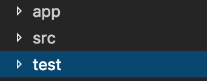

# Haskell Learning

## Getting started

### Installation

- Tools required:
  - Stack :
    - build tool for Haskell
    - 
    `curl -sSL https://get.haskellstack.org/ | sh`


### Create a new project

- `stack new <project_name>` will create a new directory.

#### stack.yaml

Once a project is created you'll see **stack.yaml** file created, and few others like LICENSE, <project_name>.cabal, Setup.hs.
stack.yaml has a field "resolver", it tells you which version of ghci you want to use.

### Building
```sh
    stack setup
    stack build
    stack exec <project_name>
```

### Project structure

project is built, tested and managed via the <project_name>.cabal file. Here you can mention the libraries, packages to include.

#### cabal file

```haskell
library
  hs-source-dirs:      src
  exposed-modules:
    Lib
```

Among the configuration files, you will also see a directory structure:


This is the default structure of the project, but can be changed with respective changes in cabal file.

## Code

Add code to src library ( or the one mentioned in cabal file _(Library->hs-source-dirs)_.

### module

modules are like packages in java. or modules in java 9. You can expose them as library for others to use. publish them to hackage too.

```haskell
module <module_name> (exposed functions) where
    {-- code here --}
```

### function

function, like any expression in haskell, has a signature and a type.

**Declaration**

```haskell
func :: Int -> Int
```

Here func takes an argument of the type Int and returns Int
